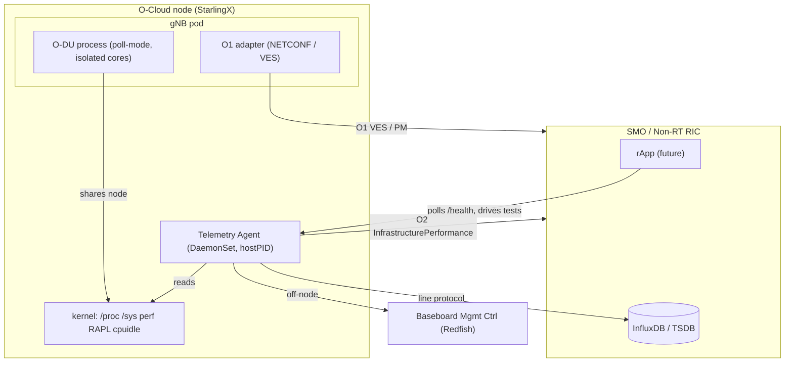
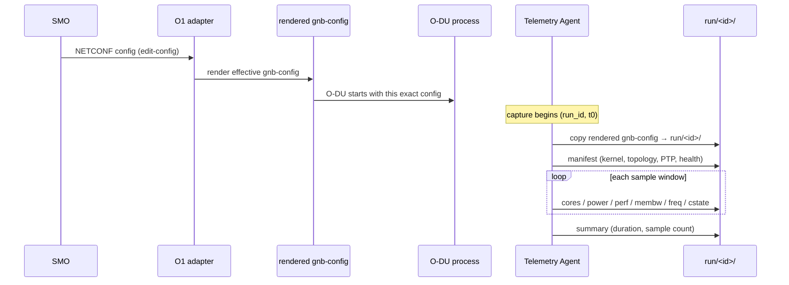
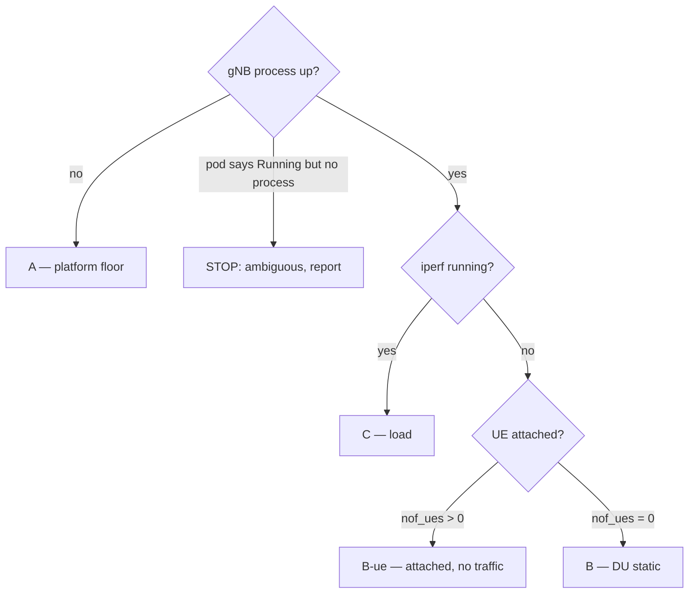
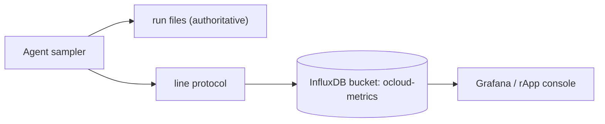
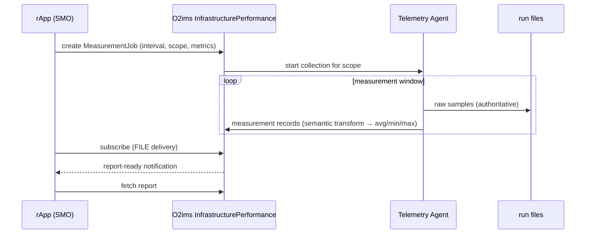

# O-Cloud Telemetry Agent — Design Blueprint

*A standards-aligned, RAN-agnostic method for measuring the CPU and energy cost
of a Split 7.2x O-DU on a shared O-Cloud, and exposing it over O2.*

> **Status: design + proof-of-concept.** This document describes the
> investigation, the architecture, and the measurement method. It states what
> **can** be captured and **how**, not what was measured. Numerical results are
> deliberately excluded; they belong in the evaluation once the proof-of-concept
> is exercised end to end.

---

## 1. Motivation and problem statement

Open RAN moves baseband processing off custom silicon onto commodity servers
managed as an **O-Cloud** (here, StarlingX). Energy is now a first-class
operational concern: a software Distributed Unit (O-DU) can consume tens of
watts continuously, and operators need to know **how much energy a network
function costs and how that cost changes with load**.

The obstacle is a measurement one. A Split 7.2x O-DU built on DPDK uses
**poll-mode** packet processing on **isolated, tickless CPU cores**. This breaks
the assumptions behind the standard telemetry the industry relies on:

- **Scheduler-visible CPU occupancy (`/proc/stat`) measures *occupancy*, not
  *utilization*.** A poll loop never yields, so the scheduler always sees the
  core as "busy" regardless of how much real work it is doing. Occupancy can be
  pinned high independent of load.
- The energy-estimation methods defined in **3GPP TS 28.554 §6.7.3.1.4** and
  **O-RAN WG6 O-Cloud-ES Table 6.3-2** attribute node energy in proportion to
  **CPU time / vCPU usage**. If CPU time does not track work for this workload
  class, those estimators may be invalid for exactly the deployment O-RAN
  specifies.

**Investigation question:** *For a Split 7.2x O-DU on a conformant O-Cloud, does
scheduler-visible CPU occupancy track offered load — and if not, what telemetry
does, and how can it be exposed to the SMO through standard O-RAN interfaces?*

This blueprint proposes an agent that measures the metrics that **do** vary with
work (energy, retired instructions, cache behaviour, memory bandwidth, idle-state
residency), binds every measurement to the exact gNB configuration that produced
it, and exposes the node-level results over the O-RAN **O2** interface —
complementing an O1/rApp control loop.

---

## 2. Where the agent runs

- **The agent runs *on the node that runs the workload*** — as a Kubernetes
  **DaemonSet** with `hostPID: true`, or standalone for one-shot captures. It is
  co-located with the O-DU because the metrics it needs (RAPL energy, PMU
  counters, idle residency, per-thread CPU) are node-local and cannot be read
  remotely.
- It is **observational only**: it never modifies the RAN stack, the cluster, or
  the node. It reads kernel interfaces and reports.
- **Redfish is read off-node** — a node generally cannot route to its own BMC, so
  whole-chassis power is collected from a reachable host and joined to the run by
  identifier.

---

## 3. What can be captured

Two families: **telemetry** (the measurement) and **health** (operator
convenience). Neither depends on the RAN vendor.

### 3.1 Telemetry

| Domain | Metric | Purpose |
|---|---|---|
| CPU occupancy | per-core busy %, user/system/irq/softirq/iowait split | the "occupancy ≠ utilization" question; valid for non-isolated (CU/control) cores |
| Idle residency | per-core time in each C-state (POLL, C1, …), stale-counter–guarded | the *mechanism*: why isolated cores never sleep |
| Package energy | RAPL per package + DRAM (joules, watts) | true energy cost; **varies with work even when occupancy is flat** |
| Platform power | Redfish whole-chassis watts | node-level energy the CPU counters can't see |
| Retired work | instructions, cycles → **IPC**; cache-references, cache-misses → **MPKI** | discriminates a spinning loop from real compute |
| Delivered frequency | `aperf`/`mperf`/`tsc` ratio | detects thermal/AVX throttling that would skew energy comparisons |
| Hardware C-states | `cstate_core` C1/C6 residency (PMU) | independent cross-check of the sysfs idle counters |
| Memory bandwidth | per-socket read/write (IMC via perf `--per-node`) | bottleneck / NUMA-pressure analysis |
| Per-thread CPU | per-tid CPU %, last core, allowed mask, container id | separates O-DU threads from CU/control; detects thread migration |
| NUMA placement | node cpus/memory/hugepages, fronthaul-NIC socket alignment | correctness (cross-socket access costs latency under 500 µs deadlines) |
| Context / provenance | kernel cmdline, isolated set, SMT, hugepages, PTP argv, topology | reproducibility; recorded in every run manifest |

### 3.2 Health (heartbeat)

| Check | What it flags |
|---|---|
| PTP sync | `master_offset` beyond threshold, grandmaster absent/wrong, ptp4l/phc2sys down |
| Time offset | PHC↔REALTIME drift (UTC-offset misconfiguration) |
| iptables | ruleset changed vs a first-run baseline (shared-node interference) |
| ip route | routing table changed vs baseline |
| Fronthaul NIC/VF | link down, VF spoof/link-state/trust change, TX drops |

Health exists because the node is **shared**: PTP desync, an iptables flush, or a
route change by another user can silently corrupt a run. The heartbeat surfaces
these without a human logging into the node.

---

## 4. How it is captured (the Linux / Kubernetes / StarlingX mechanics)

Everything is read through standard kernel and platform interfaces — no
RAN-specific hooks.

| Data | Mechanism |
|---|---|
| Per-core occupancy | `/proc/stat` (not namespaced → host-wide even inside a container) |
| Idle residency | `/sys/devices/system/cpu/cpuN/cpuidle/stateM/time` |
| Package/DRAM energy | `/sys/class/powercap/intel-rapl:*/energy_uj` (root; wraps at `max_energy_range_uj`) |
| IPC, MPKI, hw C-states, delivered freq, memory bandwidth | `perf stat` on core PMU, `msr` PMU, `cstate_*` PMU, `uncore_imc` PMU (`--per-node`) |
| Per-thread CPU | `/proc/<pid>/task/<tid>/stat` and `.../status`; container via `/proc/<pid>/cgroup` |
| Process discovery across the node | **`hostPID: true`** → the container's `/proc` sees every host process (no `nsenter` needed) |
| Whole-chassis power | **Redfish** REST on the BMC (DMTF DSP2046/DSP2051), read off-node |
| NUMA topology | `/sys/devices/system/node/*`, `/sys/bus/pci/<addr>/numa_node` |
| PTP health | `pmc` management client on the ptp4l UDS; `pgrep` for daemons |
| Firewall / routing state | `iptables-save` (nft backend), `/proc/net/route` |
| Fronthaul VF state | `ip -s link show dev <iface>` |
| Deployment / scheduling context | Kubernetes API (pod phase, labels) — used only to *enrich*, never as ground truth |
| Privilege | Pod runs `runAsUser: 0` + `CAP_PERFMON` + `CAP_SYS_PTRACE`; StarlingX namespace labelled `privileged` (Pod Security Admission) |

**Ground-truth principle.** Liveness is the **process** (`pgrep`), not the pod —
because on a shared/edge O-Cloud the kubectl context may not even see the pod that
runs on the node, and a pod can read *Running* during a restart loop while the
process is absent. Kubernetes is used to add context, never to override the
kernel.

### Sampling correctness (design invariants)

The measurement loop encodes several invariants that naïve tools get wrong:

- The measurement **window is measured**, midpoint-to-midpoint — never assumed
  from `sleep`, because reading dozens of cores takes real time.
- **All** idle states count as idle (POLL is idle too); busy is not `100 − C1%`.
- Idle counters that go **stale** on deeply-idle tickless cores are detected and
  reported as *stale*, never as a busy figure.
- Counters are **differenced**, never reported cumulatively.
- Energy wraps at the hardware range, not `2^32`.
- CPU enumeration comes from `/sys`, never `nproc` (which under-reports under
  `kthread_cpus=`).

---

## 5. How the gNB configuration is captured per run

The core reproducibility mechanism, and the reason results from different
conditions are comparable.

Every capture creates an immutable run directory containing **the rendered
`gnb-config` the O-DU actually ran**, plus the manifest and all per-sample CSVs,
all bound by one `run_id`. Because the config lives *with* the measurement, two
runs can be compared with certainty about what differed between them — the config
can never drift away from the numbers it produced. Correlation across sources uses
a **monotonic offset from `t0`**, never wall-clock time.

Capture conditions are **auto-detected**, so labels cannot be applied by mistake:

The framework **never generates traffic** — load is driven externally (by the
rApp); the agent only detects that traffic exists and labels accordingly.

---

## 6. How data reaches InfluxDB (planned)

*Not yet implemented; described here as the intended path.*

The authoritative record is always the **run files** (immutable, no network
dependency). InfluxDB is a convenience layer for live dashboards.

- Each per-sample record maps to an InfluxDB **measurement** with tags
  (`run_id`, `node`, `socket`, `condition`) and fields (watts, joules, busy%,
  IPC, MPKI, membw, delivered-freq, C-state residency).
- A **new, separate bucket** keeps O-Cloud resource metrics distinct from RAN KPI
  pipelines, so the two never intermingle.
- Files remain the source of truth; if the TSDB is unavailable, no data is lost —
  it is backfilled from the run directory.

---

## 7. How it travels through O2, and why O2 matters

### 7.1 Interface split

Node CPU and energy are **O-Cloud infrastructure** properties. The correct SMO
interface for them is **O2**, not O1:

- **O2** — SMO ↔ O-Cloud. Carries infrastructure inventory, monitoring, and
  **performance** (`O2ims_InfrastructurePerformance`, specified in
  O-RAN WG6 O2IMS Interface, clause for the Performance service).
- **O1** — SMO ↔ Managed Element. Carries the gNB's own PM (e.g. data volume).

3GPP TS 28.552 "PEE" energy measurements are **PNF-related** — they assume a
physical box with a sensor. A containerized DU has none, so its energy is
attributed at the **O-Cloud** layer and belongs on **O2**.

### 7.2 Path through O2

- The rApp creates a **MeasurementJob**; the agent collects and returns
  **measurement records**. A **semantic transformation** condenses high-rate raw
  samples to the conformant reporting interval (min/avg/max), so research-grade
  1 Hz capture goes to files while standards-cadence summaries go to O2.
- Metrics that O-RAN's information model does not yet name (IPC, MPKI, per-socket
  bandwidth, C-state residency) are carried through the model's sanctioned
  **`extensions`** mechanism, so nothing is smuggled outside the schema.

### 7.3 Importance of O2

O2 is the **only architecturally-correct home** for O-Cloud energy: it is where
the SMO already talks to the cloud platform, where infrastructure inventory lives
(providing the resource identifiers and topology the measurements attach to), and
where WG6 is actively specifying energy. Exposing energy here — rather than in an
ad-hoc sidecar or a private database — makes the work **standards-conformant and
consumable by any O-RAN SMO**, not just this testbed.

### 7.4 How it complements O1 / the rApp

The rApp closes the loop:

- reads **energy** from **O2** (this agent) and **data volume** from **O1**
  (the gNB PM),
- computes the **Energy Efficiency KPI** (bits per joule, per 3GPP TS 28.554
  §6.7) that *neither interface can produce alone*,
- polls the agent's **/health** endpoint to gate its own decisions (don't trust
  telemetry captured while PTP was desynced),
- drives the load sweep and reads back the per-condition energy curve.

The agent is the **measurement substrate**; the rApp is the **control and
analysis** layer above it. Cleanly separated, and each independently useful.

---

## 8. Novelty and platform-independence

### 8.1 RAN-agnostic by construction

The agent never links against, patches, or reads the source of any RAN stack. It
reads kernel and platform interfaces (`/proc`, `/sys`, `perf`, Redfish). The only
RAN-specific input is a **single environment variable** naming the O-DU process
(e.g. `gnb` vs `nr-softmodem`). The **same binary instruments two different RAN
implementations identically**, which is what makes a cross-stack interoperability
comparison meaningful rather than a comparison of two unrelated experiments.

### 8.2 What is novel

1. **A measurement method valid for poll-mode 7.2x O-DUs.** It treats occupancy
   as suspect and grounds energy claims in RAPL + PMU + Redfish, with an explicit
   stale-counter guard for tickless isolated cores.
2. **Standards exposure of O-Cloud energy over O2** — a reference realization of
   `O2ims_InfrastructurePerformance` carrying validated CPU/energy for a real DU,
   including a proposed **PM Dictionary** for a poll-mode-DU resource type and an
   **ICS** documenting conformance and deviations.
3. **Provenance binding** — the rendered gNB config archived with every run, so
   energy is always attributable to an exact configuration.
4. **The O1↔O2 join** — computing the 28.554 energy-efficiency KPI from two
   interfaces that individually cannot, via the rApp.

### 8.3 Relation to prior work

*(References listed in §11; the author will attach links.)*

- **`cpu_service.py` (predecessor tool).** Same *architectural role* — a
  telemetry container exposing a local API to a controller — but it uses
  `nsenter` per sample (heavy fork/exec overhead), computes per-thread CPU
  against an assumed 1 s window (inflating values), keys energy incorrectly, and
  exposes nothing over a standard interface. This agent removes the overhead
  (`hostPID`, no `nsenter`), measures the window explicitly, guards stale
  counters, adds RAPL/PMU/Redfish, and — critically — exposes results over
  **O2** with a documented dictionary and ICS.
- **Crespo et al., "Energy-Aware CPU Orchestration in O-RAN: A dApp-Driven
  Lightweight Approach."** Demonstrates OS-level CPU/energy actuation on srsRAN,
  but its measurements assume a Split-8/USRP setup where CPU occupancy tracks
  load, and its "O-RAN compliance" is architectural (no E3/O1/O2 implemented). It
  is a **dApp under the original 2022 concept**, not the 2025 reference
  architecture. This work is complementary: it sits at the O1/O2 measurement
  tier, is standards-exposed, and targets the 7.2x/DPDK workload where the
  occupancy assumption breaks.
- **TENORAN — automated energy-efficiency profiling for O-RAN.** A strong
  measurement scaffold (Kepler + PDU + RU meters) but non-standard on the
  interface side (Prometheus/Grafana, no O2/O1), and it observes an OAI-vs-srsRAN
  energy difference it explicitly does not explain. This work proposes the
  mechanism (attribution model vs poll-mode occupancy) and standardizes the
  exposure path.
- **3GPP / O-RAN specifications.** The design maps directly onto TS 28.552 (PM),
  TS 28.554 (EE KPI), O-RAN WG6 O2IMS (Performance service), O-Cloud Information
  Model (measurement records, extensions), and O-Cloud-ES (energy metrics and
  use cases).

---

## 9. Standards alignment

| Standard | How this work aligns |
|---|---|
| **3GPP TS 28.552** | Performance-measurement model and file/notification reporting pattern followed for the energy metrics. |
| **3GPP TS 28.554 §6.7** | Energy-Efficiency KPI (bits/joule) is the target output of the O1↔O2 join. |
| **O-RAN WG6 O2IMS Interface** | `O2ims_InfrastructurePerformance` (MeasurementJob / Subscription lifecycle) is the exposure surface; conformance captured in an ICS (ISO/IEC 9646-7). |
| **O-RAN WG6 O-Cloud Information Model** | Measurement records and the `extensions` point for non-standard metrics. |
| **O-RAN WG6 O-Cloud-ES** | Energy metrics (`EC_node,*`, power tables) and CPU-management use cases; this work supplies measured evidence and a resource-type PM Dictionary. |
| **DMTF Redfish (DSP2046/DSP2051)** | The specified source for physical-resource power, used off-node. |

The design also surfaces **specification gaps** it must work around (documented in
the findings): the O2 report *format* is left unspecified; some energy counters
the specs name are not exposed by server-class hardware; the O-Cloud C-state
use case assumes a state the low-latency profile removes; and the O1↔O2 join
required for the EE KPI is acknowledged but unspecified. Documenting these is part
of the contribution.

---

## 10. Limitations and disadvantages

Stated plainly, so the proof-of-concept is honest about scope:

- **RAPL has no per-core domain** and (on typical server CPUs) no per-core PP0
  domain; energy is per-package. Attribution to a single NF requires the node be
  otherwise quiet, or a proportional model whose validity is exactly what this
  work scrutinizes.
- **Redfish is off-node and coarse** (typically ~1 s granularity) — fine for
  test-duration averages, not for sub-slot dynamics.
- **The uncore PMU / MSR reads need privilege** (root or `CAP_PERFMON`); a
  non-privileged deployment degrades those metrics gracefully but loses them.
- **Occupancy is only meaningful for non-isolated (CU/control) cores.** For the
  poll-mode DU cores it is deliberately treated as non-informative — the method
  substitutes energy/IPC there, which is the point, but it means no single metric
  covers the whole gNB.
- **O2 exposure is a reference implementation, not production** — a partial,
  declared-conformant realization; the report format is a local profile because
  the standard leaves it open.
- **Health baselining is naïve for now** — it snapshots current firewall/route
  state and flags *change*, without yet knowing the "correct" ruleset (the
  service path is not fully up). This is intentional and will be refined.
- **Shared-node contention** can perturb energy readings; the control-socket and
  health heartbeat mitigate but do not eliminate this.

---

## 11. References

*Links to be attached by the author.*

1. Crespo et al., *Energy-Aware CPU Orchestration in O-RAN: A dApp-Driven
   Lightweight Approach.*
2. *TENORAN* — automated energy-efficiency testing framework for Open RAN
   (Northeastern / OpenRAN Gym lineage).
3. Lacava et al., *dApps: Distributed Applications for Real-Time Inference and
   Control in O-RAN* (dApp reference architecture, E3 interface).
4. D'Oro et al., *dApps: Enabling Real-Time AI-Based Open RAN Control* (original
   dApp concept).
5. 3GPP TS 28.552, *Management and orchestration; 5G performance measurements.*
6. 3GPP TS 28.554, *Management and orchestration; 5G end-to-end KPIs.*
7. O-RAN WG6, *O2 IMS Interface Specification* (InfrastructureInventory /
   Monitoring / Performance).
8. O-RAN WG6, *O-Cloud Information Model.*
9. O-RAN WG6, *Study on O-Cloud Energy Savings* (Technical Report).
10. DMTF, *Redfish Resource and Schema Guide* (DSP2046) and *Redfish Telemetry*
    (DSP2051).
11. Intel, *Power Management — User Wait Instructions Power Saving for DPDK PMD
    Polling Workloads.*
12. `cpu_service.py` — predecessor telemetry tool (internal).

---

*This blueprint describes intent and method. A proof-of-concept exercising the
full path — capture, config binding, O2 exposure, and the O1↔O2 EE-KPI join —
is required to substantiate the design.*
